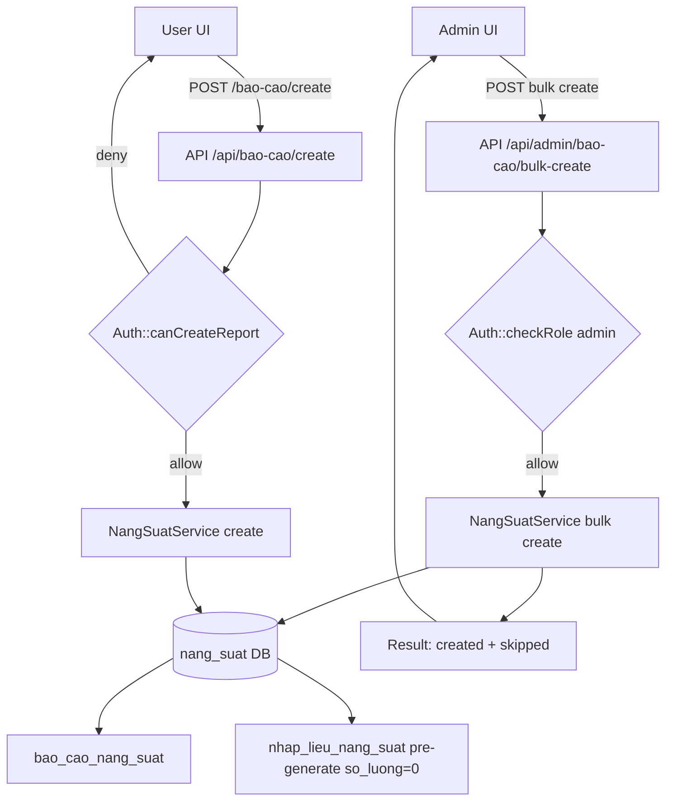
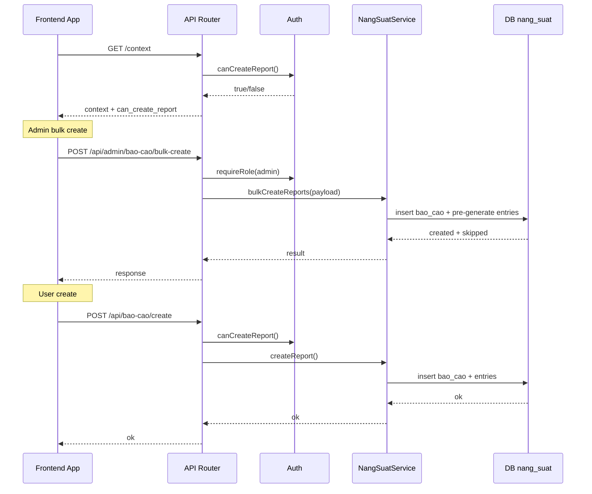

# Thiet ke quan ly quyen tao bao cao va bulk create

## Overview
Muc tieu la bo sung co che quan ly quyen tao bao cao theo 2 cach: admin tao hang loat (bulk create) hoac cap quyen cho user cu the. He thong hien chi cho phep user co LINE duoc gan moi tao bao cao, do do can bo sung kiem tra quyen moi `tao_bao_cao` theo mau hien co `can_view_history`.

Pham vi bao gom API contract, luong xu ly quyen, va quy tac kiem tra tren frontend. Khong bao gom migration hay UI mockup.

## Architecture
- DB `mysqli` luu quyen trong `user_permissions` voi key `tao_bao_cao`.
- DB `nang_suat` luu bao cao va entries (bao_cao_nang_suat, nhap_lieu_nang_suat).
- Auth layer them helper `Auth::canCreateReport()` theo mau `canViewHistory()`.
- API layer them endpoint admin bulk create, chi admin duoc goi.
- Frontend lay `can_create_report` tu session/context de bat tat chuc nang tao bao cao.

## Options & Trade-offs
### Option A: Chi admin bulk create, user muon tao thi can quyen `tao_bao_cao` va co line
- Uu: Don gian, giong quy tac hien tai; kiem soat chat che ai duoc tao.
- Nhuoc: User chua co line thi khong the tu tao, phu thuoc admin gan line.

### Option B: User co quyen `tao_bao_cao` co the chon line bat ky
- Uu: Linh hoat cao.
- Nhuoc: Mo rong bieu dien quyen va rui ro sai lech du lieu (tao bao cao sai line), can them UI chon line va kiem tra phuc tap.

### Option C: Ban danh sach line tren user_permissions
- Uu: Chinh xac pham vi quyen.
- Nhuoc: Can migration va thay doi data model, khong nam trong scope.

**Khuyen nghi**: Option A. Ly do: giam rui ro, khong mo rong data model, phu hop rang buoc hien tai (user phai co line), dong bo voi rules hien co.

## Data flow


## Component interaction diagram


## API contracts
### POST /api/admin/bao-cao/bulk-create
- Auth: admin only
- CSRF: required
- Muc dich: tao bao cao hang loat theo line + ma_hang + ngay + ca.
- Cong doan va moc gio lay theo routing + moc_gio_set (LINE-specific hoac default).

#### Request schema
```json
{
  "items": [
    {
      "line_id": 1,
      "ma_hang_id": 10,
      "ngay": "2026-01-07",
      "ca_id": 1
    }
  ],
  "skip_existing": true
}
```

#### Response schema (200)
```json
{
  "success": true,
  "message": "Da tao bao cao hang loat",
  "data": {
    "created": [
      {
        "line_id": 1,
        "ma_hang_id": 10,
        "ngay": "2026-01-07",
        "ca_id": 1,
        "bao_cao_id": 123
      }
    ],
    "skipped": [
      {
        "line_id": 2,
        "ma_hang_id": 12,
        "ngay": "2026-01-07",
        "ca_id": 1,
        "reason": "exists",
        "bao_cao_id": 456
      }
    ]
  }
}
```

#### Error handling
- 400: missing fields, items empty, invalid date format
- 401: not logged in
- 403: not admin
- 409: optional, neu can bao loi trung toan bo (khong chon trong thiet ke nay)
- 500: server error

### Helper Auth::canCreateReport()
- Admin => true
- Neu chua dang nhap => false
- Neu khong co line_id => false
- Neu co quyen `tao_bao_cao` trong `user_permissions` => true
- Neu khong co quyen => false

## Data model
- `mysqli.user_permissions` them key `tao_bao_cao`
- Khong can them bang moi trong scope

## Security
- Admin bulk create yeu cau `requireRole(admin)` + CSRF.
- User create yeu cau `Auth::canCreateReport()`.
- Tam dung theo CORS va security headers hien co.

## Observability
- Log server (info) cho so luong created/skipped theo request.
- Tra ve `created`/`skipped` trong response de frontend thong bao.

## Rollout/Migration
- Can migration them quyen `tao_bao_cao` vao danh sach quyen (subtask rieng).
- Frontend chi hien chuc nang tao bao cao khi `can_create_report` = true.

## Testing
- Unit: Auth::canCreateReport() voi cac truong hop admin, co quyen, khong quyen, khong line.
- API: bulk create happy path, skip existing, invalid payload, missing CSRF, not admin.
- Frontend: UI an/hiem nut tao bao cao theo `can_create_report`.

## Risks & open questions
- Xung dot du lieu khi bulk create dong thoi voi user create (can lock/unique constraint). Gia dinh co unique key theo (line_id, ma_hang_id, ngay, ca_id).
- Can ro rang logic routing/moc_gio_set neu khong tim thay preset (fallback default).

## Implementation plan
- [ ] Cap nhat design doc va diagram (0.5 day, architect)
- [ ] Backend: them Auth::canCreateReport va kiem tra endpoint create (1 day, code)
- [ ] Backend: them endpoint POST /api/admin/bao-cao/bulk-create (1-2 day, code)
- [ ] Frontend: bo sung can_create_report vao context va UI toggle (0.5-1 day, frontend)
- [ ] Test cases va manual test checklist (0.5 day, code)
