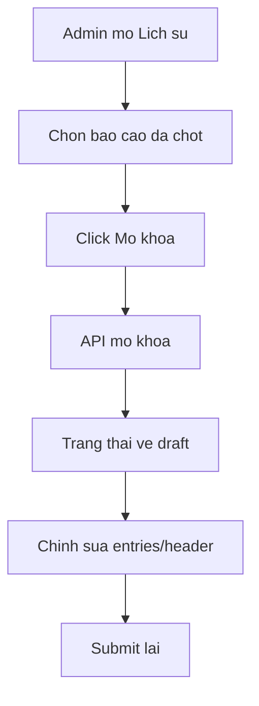

# Thiet ke mo khoa bao cao da chot (admin only)

## Overview
- Muc tieu: Cho admin mo khoa bao cao da chot de chinh sua va submit lai.
- Pham vi: Chi admin duoc mo khoa; khong audit log; UI nut Mo khoa chi o man Lich su; sau mo khoa bat buoc submit lai.
- Ngoai pham vi: Cap quyen cho vai tro khac, sua truc tiep bao cao da chot, audit log.

## Architecture
- Backend giu nguyen luong mo khoa hien tai trong [`handleBaoCao()`](api/index.php:247) va trang thai doi ve draft.
- Frontend them nut Mo khoa o man Lich su cho admin (dua tren session vai_tro).

## Data flow

## API contracts
- Mo khoa bao cao: su dung action unlock trong handler [`handleBaoCao()`](api/index.php:247).
- Chinh sua sau mo khoa: su dung cac endpoint cap nhat entries/header va submit theo luong hien tai.

## Data model
- Khong thay doi schema.
- Trang thai bao cao van theo flow draft -> submitted -> approved -> locked, voi mo khoa la thao tac admin dua ve draft (ngoai flow chuan).

## Security
- Chi admin duoc mo khoa (kiem tra role o [`handleBaoCao()`](api/index.php:323)).
- CSRF bat buoc cho thao tac mo khoa.
- Khong cap quyen mo khoa theo user_permissions.

## Observability
- Khong audit log.
- Neu can theo doi, chi su dung log he thong web server (ngoai pham vi).

## Rollout/Migration
- Khong can migration.
- Rollout chuan: cap nhat frontend va backend theo quy trinh deploy hien tai.

## Testing
- Admin mo khoa bao cao da chot: trang thai ve draft.
- Sau mo khoa: chinh sua entries/header duoc, submit lai thanh cong.
- Nguoi khong phai admin: khong thay nut Mo khoa va API tu choi.

## Options
1) Giu admin-only unlock (de xuat)
- Uu: Don gian, phu hop yeu cau, khong thay doi permission.
- Nhuoc: Phu thuoc admin, khong phan quyen linh hoat.

2) Them permission can_unlock_report
- Uu: Linh hoat cap quyen.
- Nhuoc: Them UI quan ly quyen, nguy co lam rong dac quyen.

3) Cho sua truc tiep bao cao da chot
- Uu: Nhanh cho nguoi dung.
- Nhuoc: Pha vo quy trinh kiem soat, rui ro du lieu.

## Recommended approach
- Chon Option 1: admin-only unlock, khong audit log, nut Mo khoa chi o Lich su.

## Risks & open questions
- Hien tai khong co UI nut Mo khoa; can xac nhan vi tri va ham goi API tu man Lich su.
- Mo khoa la thao tac ngoai flow trang thai chuan; can thong bao ro trong UI.

## Implementation plan (checklist, uoc tinh)
- [ ] Cap nhat UI Lich su: hien nut Mo khoa cho admin, goi API mo khoa (Frontend, 0.5-1 ngay)
- [ ] Kiem tra thong bao trang thai va reload du lieu sau mo khoa (Frontend, 0.5 ngay)
- [ ] Bo sung kiem thu API mo khoa voi admin/non-admin (Backend/QA, 0.5 ngay)
- [ ] Cap nhat tai lieu huong dan van hanh neu can (Docs, 0.25 ngay)
