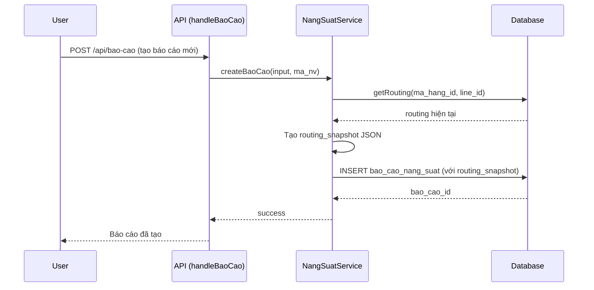
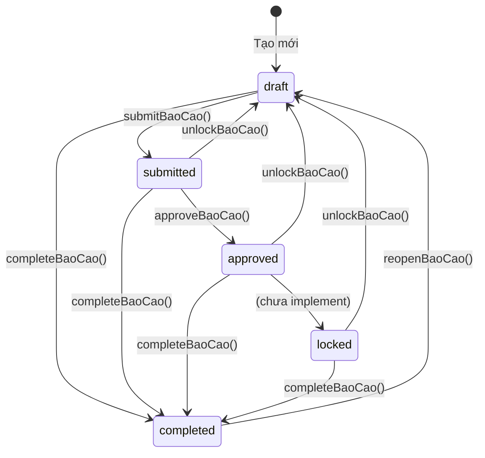

# Routing Snapshot - Cơ chế hoạt động

## Routing Snapshot được ghi nhận khi nào?

**Routing Snapshot được ghi nhận TẠI THỜI ĐIỂM TẠO BÁO CÁO MỚI** - không phải khi submit hay approve.

### Luồng hoạt động



### Code thực hiện

Trong [`classes/NangSuatService.php`](../classes/NangSuatService.php:156-171):

```php
public function createBaoCao($input, $ma_nv) {
    // ... validation ...
    
    // Lấy routing hiện tại từ database
    $routing = $this->getRouting($ma_hang_id, $line_id);
    
    // Tạo snapshot JSON
    $routingSnapshot = json_encode([
        'version' => 1,
        'created_at' => date('c'),
        'routing' => $routing
    ], JSON_UNESCAPED_UNICODE);
    
    // INSERT vào database với routing_snapshot
    $stmt = mysqli_prepare($this->db,
        "INSERT INTO bao_cao_nang_suat
         (ngay_bao_cao, line_id, ca_id, ma_hang_id, ..., routing_snapshot)
         VALUES (?, ?, ?, ?, ..., ?)"
    );
    // ...
}
```

## Tại sao một số báo cáo không có routing_snapshot?

### Nguyên nhân

1. **Báo cáo cũ**: Được tạo TRƯỚC KHI tính năng routing_snapshot được triển khai
2. **Migration chưa chạy**: Cột `routing_snapshot` được thêm qua migration [`006_add_routing_snapshot.sql`](../database/migrations/006_add_routing_snapshot.sql)

### Hậu quả

Báo cáo không có routing_snapshot sẽ:
- Sử dụng routing **HIỆN TẠI** từ bảng `ma_hang_cong_doan`
- Có thể hiển thị **SAI** công đoạn nếu routing đã bị thay đổi (qua import Excel hoặc chỉnh sửa thủ công)

## Cách routing_snapshot được sử dụng

Trong [`classes/NangSuatService.php::getBaoCao()`](../classes/NangSuatService.php:205-240):

```php
public function getBaoCao($bao_cao_id) {
    // ... lấy thông tin báo cáo ...
    
    // Kiểm tra có routing_snapshot không
    if (!empty($baoCao['routing_snapshot'])) {
        // CÓ snapshot → Sử dụng routing đã lưu
        $snapshot = json_decode($baoCao['routing_snapshot'], true);
        $baoCao['routing'] = $snapshot['routing'] ?? [];
        $baoCao['routing_is_snapshot'] = true;
    } else {
        // KHÔNG CÓ snapshot → Lấy routing hiện tại từ database
        $baoCao['routing'] = $this->getRouting($baoCao['ma_hang_id'], $baoCao['line_id']);
        $baoCao['routing_is_snapshot'] = false;
    }
    
    return $baoCao;
}
```

## Cấu trúc JSON của routing_snapshot

```json
{
    "version": 1,
    "created_at": "2026-01-20T10:30:00+07:00",
    "routing": [
        {
            "id": 1,
            "cong_doan_id": 5,
            "ten_cong_doan": "Cắt",
            "thu_tu": 1,
            "la_cong_doan_tinh_luy_ke": 1
        },
        {
            "id": 2,
            "cong_doan_id": 6,
            "ten_cong_doan": "May",
            "thu_tu": 2,
            "la_cong_doan_tinh_luy_ke": 0
        }
    ]
}
```

## Các trạng thái báo cáo

Hệ thống hỗ trợ **5 trạng thái** (định nghĩa trong [`database/schema.sql`](../database/schema.sql:102)):

| Trạng thái | Mô tả | Có thể chỉnh sửa? |
|------------|-------|-------------------|
| `draft` | Nháp - mới tạo hoặc đã mở khóa | ✅ Có |
| `submitted` | Đã gửi - chờ duyệt | ❌ Không |
| `approved` | Đã duyệt | ❌ Không |
| `locked` | Đã khóa | ❌ Không |
| `completed` | Hoàn tất | ❌ Không |

### Chuyển đổi trạng thái



## Khuyến nghị

### Cho báo cáo không có routing_snapshot

1. **Báo cáo draft**: Có thể xóa và tạo lại để có routing_snapshot
2. **Báo cáo đã chốt (completed)**: Cần cẩn thận khi import routing mới - dữ liệu có thể bị ảnh hưởng

### Trước khi import Excel

1. Kiểm tra các báo cáo không có routing_snapshot bằng script [`tests/check-routing-snapshot.php`](../tests/check-routing-snapshot.php)
2. Backup database trước khi import
3. Xem xét tạo routing_snapshot cho các báo cáo cũ (cần viết migration script)
