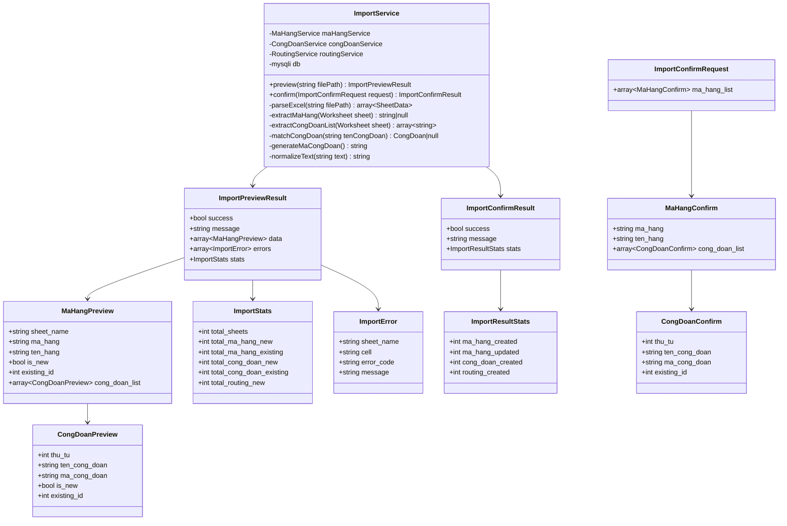
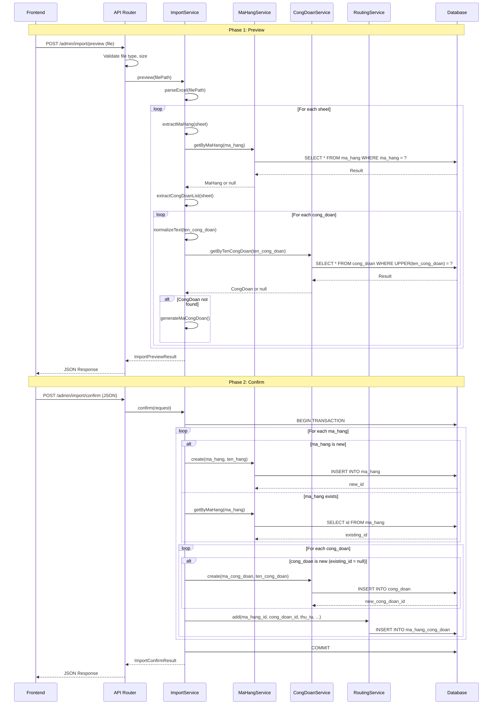

# Import Công Đoạn & Mã Hàng từ Excel - Design Document

## 1. Overview

### 1.1 Mục tiêu
Cho phép admin import danh sách công đoạn và routing từ file Excel, với workflow 2 bước:
1. **Preview**: Upload file → Parse → Hiển thị preview để user xác nhận
2. **Confirm**: User xác nhận → Lưu vào database

### 1.2 Excel Format
- Mỗi sheet = 1 mã hàng
- Ô `C2` chứa `MH: XXXX` (4 số) - mã hàng
- Ô `C5:Cxx` chứa danh sách tên công đoạn (mỗi dòng 1 công đoạn)

### 1.3 Business Rules
- **Mã công đoạn**: Auto-generate format `CD{NNN}` (VD: CD001, CD002)
- **Công đoạn matching**: Match bằng `ten_cong_doan` (case-insensitive, trim)
- **Tái sử dụng**: Nếu công đoạn đã tồn tại → tái sử dụng, không tạo mới
- **Mã hàng**: Nếu đã tồn tại → cập nhật routing, nếu chưa → tạo mới

---

## 2. Architecture

### 2.1 Component Diagram

```
┌─────────────────┐     ┌─────────────────┐     ┌─────────────────┐
│   Frontend      │     │   API Router    │     │  ImportService  │
│   (admin.js)    │────▶│  (index.php)    │────▶│                 │
└─────────────────┘     └─────────────────┘     └────────┬────────┘
                                                         │
                        ┌────────────────────────────────┼────────────────────────────────┐
                        ▼                                ▼                                ▼
               ┌─────────────────┐              ┌─────────────────┐              ┌─────────────────┐
               │  MaHangService  │              │ CongDoanService │              │ RoutingService  │
               └─────────────────┘              └─────────────────┘              └─────────────────┘
```

### 2.2 Class Diagram (Mermaid)



---

## 3. API Contracts

### 3.1 Preview Import

**Endpoint**: `POST /api/admin/import/preview`

**Headers**:
| Header | Value | Required |
|--------|-------|----------|
| Content-Type | multipart/form-data | Yes |
| X-CSRF-Token | {csrf_token} | Yes |

**Request Body** (multipart/form-data):
| Field | Type | Description |
|-------|------|-------------|
| file | File | Excel file (.xlsx, .xls) |

**Response** (200 OK):
```json
{
  "success": true,
  "message": "Phân tích file thành công",
  "data": [
    {
      "sheet_name": "Sheet1",
      "ma_hang": "1234",
      "ten_hang": "Mã hàng 1234",
      "is_new": true,
      "existing_id": null,
      "cong_doan_list": [
        {
          "thu_tu": 1,
          "ten_cong_doan": "Cắt vải",
          "ma_cong_doan": "CD001",
          "is_new": false,
          "existing_id": 5
        },
        {
          "thu_tu": 2,
          "ten_cong_doan": "May thân trước",
          "ma_cong_doan": "CD015",
          "is_new": true,
          "existing_id": null
        }
      ]
    }
  ],
  "stats": {
    "total_sheets": 3,
    "total_ma_hang_new": 2,
    "total_ma_hang_existing": 1,
    "total_cong_doan_new": 5,
    "total_cong_doan_existing": 10,
    "total_routing_new": 15
  },
  "errors": []
}
```

**Response với lỗi parse** (200 OK - partial success):
```json
{
  "success": true,
  "message": "Phân tích file hoàn tất với một số lỗi",
  "data": [...],
  "stats": {...},
  "errors": [
    {
      "sheet_name": "Sheet2",
      "cell": "C2",
      "error_code": "INVALID_MA_HANG_FORMAT",
      "message": "Không tìm thấy mã hàng trong ô C2. Định dạng cần: 'MH: XXXX'"
    },
    {
      "sheet_name": "Sheet3",
      "cell": "C5:C100",
      "error_code": "EMPTY_CONG_DOAN_LIST",
      "message": "Không tìm thấy công đoạn nào từ C5 trở đi"
    }
  ]
}
```

**Response lỗi** (4xx):
```json
{
  "success": false,
  "message": "Mô tả lỗi",
  "error_code": "ERROR_CODE"
}
```

### 3.2 Confirm Import

**Endpoint**: `POST /api/admin/import/confirm`

**Headers**:
| Header | Value | Required |
|--------|-------|----------|
| Content-Type | application/json | Yes |
| X-CSRF-Token | {csrf_token} | Yes |

**Request Body**:
```json
{
  "ma_hang_list": [
    {
      "ma_hang": "1234",
      "ten_hang": "Mã hàng 1234",
      "cong_doan_list": [
        {
          "thu_tu": 1,
          "ten_cong_doan": "Cắt vải",
          "ma_cong_doan": "CD001",
          "existing_id": 5
        },
        {
          "thu_tu": 2,
          "ten_cong_doan": "May thân trước",
          "ma_cong_doan": "CD015",
          "existing_id": null
        }
      ]
    }
  ]
}
```

**Response thành công** (200 OK):
```json
{
  "success": true,
  "message": "Import thành công",
  "stats": {
    "ma_hang_created": 2,
    "ma_hang_updated": 1,
    "cong_doan_created": 5,
    "routing_created": 15
  }
}
```

**Response lỗi** (4xx/5xx):
```json
{
  "success": false,
  "message": "Lỗi khi import: ...",
  "error_code": "IMPORT_FAILED"
}
```

---

## 4. Error Codes

| Code | HTTP Status | Description |
|------|-------------|-------------|
| `NO_FILE_UPLOADED` | 400 | Không có file được upload |
| `INVALID_FILE_TYPE` | 400 | File không phải Excel (.xlsx, .xls) |
| `FILE_TOO_LARGE` | 400 | File vượt quá 10MB |
| `INVALID_MA_HANG_FORMAT` | 200 (partial) | Ô C2 không đúng format "MH: XXXX" |
| `EMPTY_CONG_DOAN_LIST` | 200 (partial) | Không có công đoạn nào từ C5 |
| `DUPLICATE_MA_CONG_DOAN` | 400 | Mã công đoạn trùng lặp trong request |
| `IMPORT_FAILED` | 500 | Lỗi database khi import |
| `VALIDATION_FAILED` | 400 | Dữ liệu confirm không hợp lệ |

---

## 5. Sequence Diagram



---

## 6. Data Flow

### 6.1 Excel Parsing Flow

```
Excel File (.xlsx)
       │
       ▼
┌──────────────────┐
│ PhpSpreadsheet   │
│ 4.2.0            │
└────────┬─────────┘
         │
         ▼
┌──────────────────┐     ┌──────────────────┐
│ Sheet 1          │     │ Sheet 2          │
│ C2: "MH: 1234"   │     │ C2: "MH: 5678"   │
│ C5: "Cắt vải"    │     │ C5: "May cổ"     │
│ C6: "May thân"   │     │ C6: "Đóng gói"   │
│ ...              │     │ ...              │
└────────┬─────────┘     └────────┬─────────┘
         │                        │
         ▼                        ▼
┌──────────────────────────────────────────┐
│ SheetData[]                              │
│ [{                                       │
│   sheet_name: "Sheet1",                  │
│   ma_hang: "1234",                       │
│   cong_doan_list: ["Cắt vải", "May thân"]│
│ }, ...]                                  │
└──────────────────────────────────────────┘
```

### 6.2 Matching Algorithm

```
Input: ten_cong_doan = "  Cắt Vải  "
              │
              ▼
       normalizeText()
       - trim()
       - preg_replace (multi-space → single)
              │
              ▼
       normalized = "Cắt Vải"
              │
              ▼
       Query: SELECT * FROM cong_doan 
              WHERE UPPER(TRIM(ten_cong_doan)) = UPPER(?)
              │
       ┌──────┴──────┐
       ▼             ▼
   Found          Not Found
   └──►            └──►
   Reuse ID       Generate new ma_cong_doan
                  Format: CD{NNN}
                  (next available number)
```

### 6.3 Ma Cong Doan Generation

```sql
-- Tìm số lớn nhất hiện có
SELECT MAX(CAST(SUBSTRING(ma_cong_doan, 3) AS UNSIGNED)) 
FROM cong_doan 
WHERE ma_cong_doan REGEXP '^CD[0-9]+$';

-- Ví dụ: max = 14
-- Next: CD015
```

---

## 7. Security

### 7.1 Authentication & Authorization
- Endpoint yêu cầu role `admin` (kiểm tra qua `requireRole(['admin'])`)
- CSRF token bắt buộc cho cả preview và confirm

### 7.2 File Upload Security
- Chỉ chấp nhận `.xlsx`, `.xls`
- Giới hạn file size: 10MB
- File được lưu tạm trong `sys_get_temp_dir()`, xóa sau khi parse
- Validate MIME type: `application/vnd.openxmlformats-officedocument.spreadsheetml.sheet`, `application/vnd.ms-excel`

### 7.3 Data Validation
- Sanitize tất cả input từ Excel
- Escape HTML entities trong tên công đoạn
- Validate mã hàng format (4 số)

---

## 8. Observability

### 8.1 Logging Points
| Event | Log Level | Data |
|-------|-----------|------|
| File upload started | INFO | filename, size, user_id |
| Parse completed | INFO | sheet_count, ma_hang_count, cong_doan_count |
| Parse error | WARNING | sheet_name, cell, error_code |
| Import started | INFO | ma_hang_count, user_id |
| Import completed | INFO | stats (created/updated counts) |
| Import failed | ERROR | error_message, stack_trace |

### 8.2 Metrics (Future)
- `import_preview_duration_seconds`
- `import_confirm_duration_seconds`
- `import_errors_total` (by error_code)

---

## 9. Rollout / Migration

### 9.1 Prerequisites
- PhpSpreadsheet 4.2.0 đã có trong vendor/ ✓
- Không cần thay đổi database schema ✓

### 9.2 Deployment Steps
1. Deploy `ImportService.php` vào `classes/services/`
2. Update `AdminService.php` để include ImportService
3. Add route handler trong `api/index.php`
4. Deploy frontend (tab Import trong admin.js)

### 9.3 Rollback
- Xóa route handler trong `api/index.php`
- Không cần rollback database

---

## 10. Testing

### 10.1 Unit Tests

| Test Case | Input | Expected Output |
|-----------|-------|-----------------|
| Parse valid Excel | File với 2 sheets hợp lệ | 2 MaHangPreview objects |
| Parse empty sheet | Sheet không có công đoạn | Error EMPTY_CONG_DOAN_LIST |
| Parse invalid ma_hang | C2 = "ABC" | Error INVALID_MA_HANG_FORMAT |
| Match existing cong_doan | "Cắt vải" (đã có) | is_new = false, existing_id = X |
| Generate ma_cong_doan | Sau CD014 | CD015 |
| Import new ma_hang | ma_hang mới | ma_hang_created = 1 |
| Import existing ma_hang | ma_hang đã có | ma_hang_updated = 1 |

### 10.2 Integration Tests

| Test Case | Steps | Expected |
|-----------|-------|----------|
| Full import flow | Upload → Preview → Confirm | Data in database correct |
| Duplicate prevention | Import 2 lần cùng file | Không tạo duplicate |
| Rollback on error | Import với 1 lỗi giữa chừng | Không có partial data |

### 10.3 Test Files
- `tests/fixtures/import-valid.xlsx` - File hợp lệ với 3 sheets
- `tests/fixtures/import-invalid-format.xlsx` - File sai format
- `tests/fixtures/import-empty.xlsx` - File rỗng

---

## 11. Risks & Open Questions

### 11.1 Risks

| Risk | Likelihood | Impact | Mitigation |
|------|------------|--------|------------|
| Large file timeout | Medium | High | Limit 10MB, async nếu cần |
| Duplicate routing | Medium | Medium | Check existing trước khi insert |
| Unicode issues | Low | Medium | Sử dụng UTF-8 throughout |

### 11.2 Open Questions

1. **Xử lý routing cũ**: Khi update mã hàng đã có routing, có nên xóa routing cũ không?
   - **Assumption**: Giữ nguyên routing cũ, chỉ thêm mới (không ghi đè)

2. **ten_hang từ đâu**: Excel chỉ có mã hàng, không có tên hàng
   - **Assumption**: `ten_hang` = `"Mã hàng " + ma_hang`

3. **Batch size**: Nếu file lớn, có cần batch insert không?
   - **Assumption**: Limit 10MB đủ nhỏ, không cần batch

4. **Hiệu lực routing**: `hieu_luc_tu`, `hieu_luc_den` set giá trị gì?
   - **Assumption**: `hieu_luc_tu` = ngày import, `hieu_luc_den` = NULL (open-ended)

---

## 12. Implementation Plan

### 12.1 Checklist

| # | Task | Estimate | Mode | Priority |
|---|------|----------|------|----------|
| 1 | Tạo `ImportService.php` với methods `preview()`, `confirm()` | 4h | Code | P0 |
| 2 | Thêm methods helper: `parseExcel()`, `extractMaHang()`, `extractCongDoanList()` | 2h | Code | P0 |
| 3 | Thêm method `generateMaCongDoan()` trong CongDoanService | 1h | Code | P0 |
| 4 | Thêm method `getByTenCongDoan()` trong CongDoanService | 0.5h | Code | P0 |
| 5 | Thêm method `getByMaHang()` trong MaHangService | 0.5h | Code | P0 |
| 6 | Thêm route handler `handleImport()` trong `api/index.php` | 1h | Code | P0 |
| 7 | Tạo tab Import trong admin.js | 3h | Frontend | P0 |
| 8 | Unit tests cho ImportService | 2h | Debug | P1 |
| 9 | Integration tests | 1h | Debug | P1 |
| 10 | Create test fixtures | 0.5h | Debug | P1 |

**Total estimate**: ~15.5 hours

### 12.2 Dependencies

```
[1] ImportService.php
     ├── [3] generateMaCongDoan()
     ├── [4] getByTenCongDoan()
     └── [5] getByMaHang()

[6] Route handler
     └── [1] ImportService.php

[7] Frontend
     └── [6] Route handler
```

### 12.3 Handoff Notes

**Cho Code mode**:
- Bắt đầu với tasks #3, #4, #5 (helper methods)
- Sau đó task #1, #2 (ImportService)
- Cuối cùng task #6 (route handler)
- Sử dụng transaction cho confirm() để đảm bảo atomicity

**Cho Frontend mode**:
- Task #7 sau khi backend hoàn thành
- Cần 2 bước UI: Upload → Preview table → Confirm button
- Hiển thị stats và errors từ preview response

**Cho Debug mode**:
- Tasks #8, #9, #10 sau khi code hoàn thành
- Tạo test fixtures trước khi viết tests
