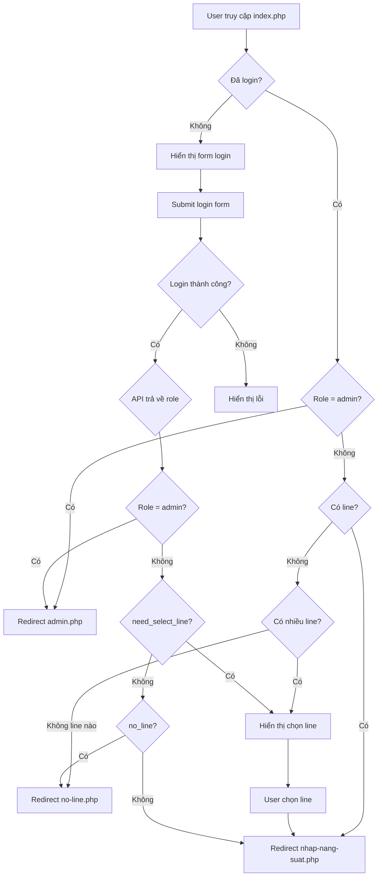
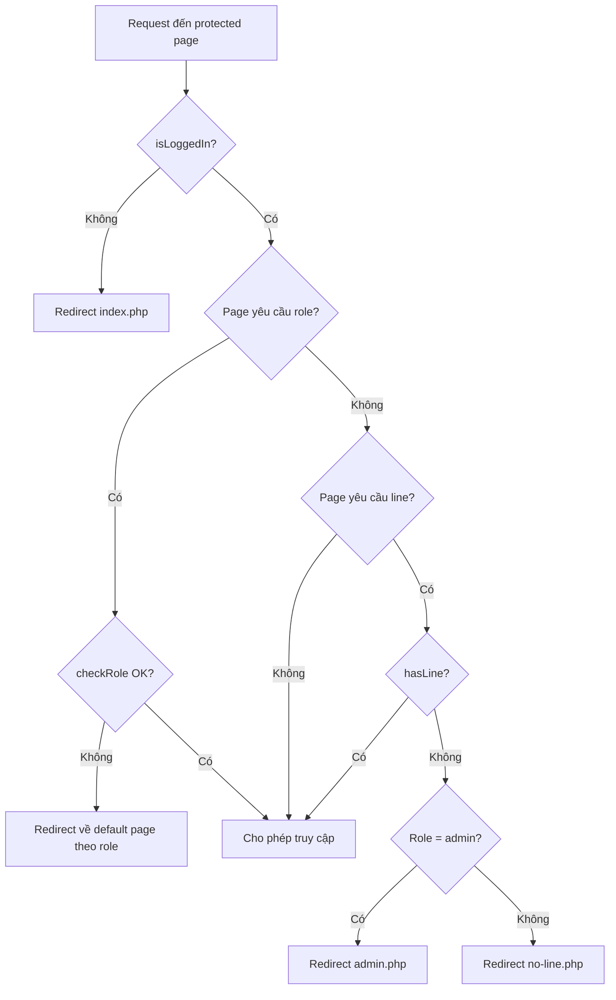

# Thiết kế Router Architecture với Protected Routes và RBAC

## 1. Tổng quan

### 1.1. Mục tiêu
Thiết kế lại logic routing để giải quyết 5 vấn đề đã xác định:
1. `index.php` yêu cầu CẢ `user_id` VÀ `line_id` để redirect
2. `app.js` hardcoded redirect đến `nhap-nang-suat.php`
3. `nhap-nang-suat.php` chặn admin không có line
4. Thiếu role-based redirect logic sau login
5. Vòng lặp redirect cho admin

### 1.2. Phạm vi
- Files cần thay đổi: `index.php`, `nhap-nang-suat.php`, `admin.php`, `assets/js/app.js`, `api/index.php`, `includes/navbar.php`
- File mới: `no-line.php` (trang thông báo cho user chưa có line)

---

## 2. Định nghĩa Routes

### 2.1. Route Classification

| Route | Type | Yêu cầu |
|-------|------|---------|
| `index.php` | Public | Không yêu cầu login |
| `no-line.php` | Protected | Login + không có line |
| `nhap-nang-suat.php` | Protected + Line Required | Login + có line |
| `admin.php` | Role-based | Login + role admin |
| `api/auth/*` | Mixed | Tùy endpoint |
| `api/admin/*` | Role-based | Login + role admin |
| `api/bao-cao/*` | Protected + Line | Login + có line |

### 2.2. Roles và Default Pages

| Role | Default Page | Yêu cầu Line |
|------|--------------|--------------|
| `admin` | `admin.php` | Không |
| `to_truong` | `nhap-nang-suat.php` | Có |
| `quan_doc` | `nhap-nang-suat.php` | Có |
| Các role khác | `nhap-nang-suat.php` | Có |

---

## 3. Authentication Flow mới

### 3.1. Sơ đồ luồng Login



### 3.2. Sơ đồ truy cập Protected Routes



---

## 4. Đặc tả thay đổi từng file

### 4.1. `classes/Auth.php`

**Thêm method mới:**

```php
public static function getDefaultPage() {
    if (!self::isLoggedIn()) {
        return 'index.php';
    }
    
    if (self::checkRole(['admin'])) {
        return 'admin.php';
    }
    
    if (self::hasLine()) {
        return 'nhap-nang-suat.php';
    }
    
    return 'no-line.php';
}
```

### 4.2. `index.php`

**Logic hiện tại:**
```php
if (isset($_SESSION['user_id']) && isset($_SESSION['line_id'])) {
    header('Location: nhap-nang-suat.php');
    exit;
}
```

**Logic mới:**
```php
require_once __DIR__ . '/classes/Auth.php';

if (Auth::isLoggedIn()) {
    header('Location: ' . Auth::getDefaultPage());
    exit;
}
```

**Giải thích:**
- Chỉ cần kiểm tra `isLoggedIn()`
- Redirect dựa trên role và trạng thái line

### 4.3. `nhap-nang-suat.php`

**Logic hiện tại:**
```php
if (!Auth::isLoggedIn()) {
    header('Location: index.php');
    exit;
}
if (!Auth::hasLine()) {
    header('Location: index.php');
    exit;
}
```

**Logic mới:**
```php
if (!Auth::isLoggedIn()) {
    header('Location: index.php');
    exit;
}

if (!Auth::hasLine()) {
    if (Auth::checkRole(['admin'])) {
        header('Location: admin.php');
    } else {
        header('Location: no-line.php');
    }
    exit;
}
```

**Giải thích:**
- Admin không có line → redirect về admin.php
- User thường không có line → redirect về no-line.php

### 4.4. `admin.php`

**Logic hiện tại:**
```php
if (!Auth::isLoggedIn()) {
    header('Location: index.php');
    exit;
}
if (!Auth::checkRole(['admin'])) {
    header('Location: nhap-nang-suat.php');
    exit;
}
```

**Logic mới:**
```php
if (!Auth::isLoggedIn()) {
    header('Location: index.php');
    exit;
}

if (!Auth::checkRole(['admin'])) {
    header('Location: ' . Auth::getDefaultPage());
    exit;
}
```

**Thay đổi navbar link:**
```php
// Thay đổi link "Về trang chính"
// Cũ: <a href="nhap-nang-suat.php">Về trang chính</a>
// Mới: <a href="admin.php">Về trang chính</a> hoặc ẩn đi
```

### 4.5. `no-line.php` (FILE MỚI)

**Mục đích:** Trang thông báo cho user đã login nhưng chưa được phân line

**Nội dung:**
- Thông báo "Tài khoản của bạn chưa được phân LINE"
- Hướng dẫn liên hệ admin
- Nút Đăng xuất
- Tự động check lại sau một khoảng thời gian

### 4.6. `assets/js/app.js`

**LoginApp - handleLogin - Logic hiện tại:**
```javascript
if (result.success) {
    if (result.need_select_line) {
        this.showLineSelect(result.lines);
    } else if (result.no_line) {
        this.showError('Tài khoản chưa được phân LINE...');
    } else {
        window.location.href = 'nhap-nang-suat.php';
    }
}
```

**Logic mới:**
```javascript
if (result.success) {
    if (result.need_select_line) {
        this.showLineSelect(result.lines);
    } else if (result.no_line) {
        window.location.href = 'no-line.php';
    } else {
        window.location.href = result.redirect_url || 'nhap-nang-suat.php';
    }
}
```

**Giải thích:**
- `no_line` → redirect đến no-line.php thay vì hiển thị error
- Sử dụng `result.redirect_url` từ API nếu có

### 4.7. `api/index.php`

**handleAuth - login response - Thêm redirect_url:**

```php
case 'login':
    // ... existing login logic ...
    $result = Auth::login($username, $password);
    
    // Thêm redirect_url vào response
    if ($result['success'] && !isset($result['need_select_line']) && !isset($result['no_line'])) {
        $result['redirect_url'] = Auth::getDefaultPage();
    }
    if ($result['success'] && isset($result['no_line']) && $result['no_line']) {
        $result['redirect_url'] = 'no-line.php';
    }
    
    response($result);
    break;
```

### 4.8. `includes/navbar.php`

**Logic home button hiện tại:**
```php
<a href="./">...</a>
```

**Logic mới:**
```php
<?php
$homeUrl = './';
if (isset($_SESSION['vai_tro']) && $_SESSION['vai_tro'] === 'admin') {
    $homeUrl = 'admin.php';
} elseif (isset($_SESSION['line_id'])) {
    $homeUrl = 'nhap-nang-suat.php';
}
?>
<a href="<?php echo $homeUrl; ?>">...</a>
```

---

## 5. Ma trận truy cập

| User State | index.php | nhap-nang-suat.php | admin.php | no-line.php |
|------------|-----------|-------------------|-----------|-------------|
| Chưa login | ✓ Show form | → index.php | → index.php | → index.php |
| Admin có line | → admin.php | ✓ Cho phép* | ✓ Cho phép | → admin.php |
| Admin không line | → admin.php | → admin.php | ✓ Cho phép | → admin.php |
| User có line | → nhap-nang-suat.php | ✓ Cho phép | → nhap-nang-suat.php | → nhap-nang-suat.php |
| User không line | → no-line.php | → no-line.php | → no-line.php | ✓ Show msg |

*Lưu ý: Admin vẫn có thể truy cập nhap-nang-suat.php nếu có line được phân

---

## 6. API Response Contract

### 6.1. POST /api/auth/login

**Request:**
```json
{
    "username": "string",
    "password": "string"
}
```

**Response - Success với redirect:**
```json
{
    "success": true,
    "message": "Đăng nhập thành công",
    "redirect_url": "admin.php"
}
```

**Response - Cần chọn line:**
```json
{
    "success": true,
    "message": "Vui lòng chọn LINE",
    "need_select_line": true,
    "lines": [
        {"id": 1, "ma_line": "L01", "ten_line": "Line 1"},
        {"id": 2, "ma_line": "L02", "ten_line": "Line 2"}
    ]
}
```

**Response - Không có line:**
```json
{
    "success": true,
    "message": "Đăng nhập thành công nhưng chưa được phân LINE",
    "no_line": true,
    "redirect_url": "no-line.php"
}
```

### 6.2. POST /api/auth/select-line

**Response - Thêm redirect_url:**
```json
{
    "success": true,
    "message": "Đã chọn LINE thành công",
    "redirect_url": "nhap-nang-suat.php"
}
```

---

## 7. Giải quyết 5 vấn đề đã xác định

| # | Vấn đề | Giải pháp |
|---|--------|-----------|
| 1 | index.php yêu cầu CẢ user_id VÀ line_id | Chỉ check isLoggedIn, redirect theo getDefaultPage |
| 2 | app.js hardcoded redirect | Sử dụng redirect_url từ API response |
| 3 | nhap-nang-suat.php chặn admin | Admin không có line → redirect admin.php |
| 4 | Không có role-based redirect | Thêm getDefaultPage method trong Auth.php |
| 5 | Vòng lặp redirect | Logic redirect rõ ràng theo role và line state |

---

## 8. Cấu trúc file no-line.php

```
no-line.php
├── PHP Header
│   ├── session_start
│   ├── require Auth.php
│   └── Auth guards
│       ├── Không login → redirect index.php
│       ├── Có line → redirect nhap-nang-suat.php
│       └── Là admin → redirect admin.php
├── HTML Content
│   ├── Navbar (không có home button)
│   ├── Message container
│   │   ├── Icon cảnh báo
│   │   ├── Tiêu đề: Chưa được phân LINE
│   │   ├── Mô tả: Liên hệ admin
│   │   └── Nút Đăng xuất
│   └── Footer
└── JavaScript
    ├── Logout handler
    └── Optional: Auto-refresh check
```

---

## 9. Rollout Plan

### Phase 1: Backend Changes
1. Thêm method `getDefaultPage()` vào Auth.php
2. Cập nhật api/index.php để trả về redirect_url
3. Tạo file no-line.php

### Phase 2: Route Guards
4. Cập nhật logic trong index.php
5. Cập nhật logic trong nhap-nang-suat.php
6. Cập nhật logic trong admin.php

### Phase 3: Frontend Changes
7. Cập nhật app.js LoginApp
8. Cập nhật includes/navbar.php

### Phase 4: Testing
9. Test các scenarios trong ma trận truy cập
10. Test redirect loops
11. Test role-based access

---

## 10. Risks và Mitigation

| Risk | Impact | Mitigation |
|------|--------|------------|
| Breaking existing sessions | Medium | Session variables không thay đổi |
| Redirect loops | High | Test kỹ ma trận truy cập |
| Hardcoded URLs khác | Low | Search codebase cho các hardcoded URLs |
| Cache browser | Low | Thêm cache-control headers nếu cần |

---

## 11. Open Questions

1. **Có cần trang chọn line riêng?** Hiện tại modal chọn line nằm trong index.php. Có thể giữ nguyên.

2. **Admin có nhiều line có cần chọn?** Hiện tại logic Auth::login sẽ auto-set nếu có 1 line, hoặc yêu cầu chọn nếu nhiều. Admin có thể có line hoặc không.

3. **Timeout session?** Có thể thêm check session timeout trong tương lai.
