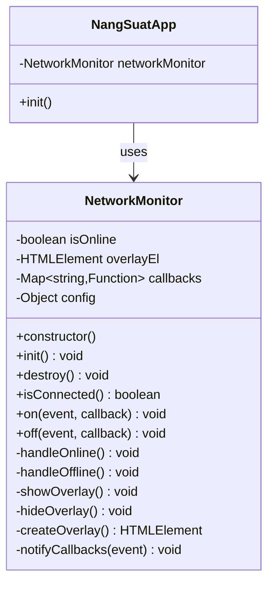
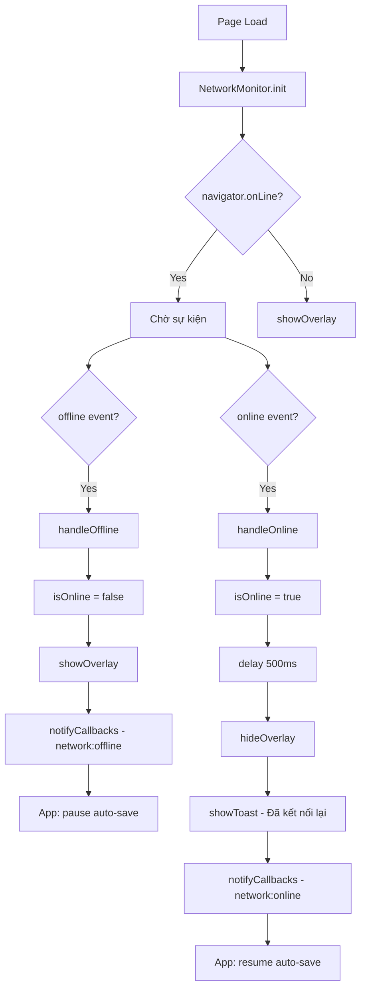

# Kế Hoạch: Network Monitor Module

## 1. Tổng Quan

### Mục tiêu

Implement Network Monitor Module - tính năng detect offline/online và hiển thị overlay khi mất kết nối mạng trên trang Nhập Năng Suất. Module này giúp người dùng nhận biết ngay lập tức khi mất kết nối internet, ngăn chặn việc mất dữ liệu khi thao tác offline.

### Lý do cần tính năng này

- **Tránh mất dữ liệu**: Auto-save feature hiện tại sẽ thất bại nếu mất mạng, cần thông báo cho người dùng
- **UX tốt hơn**: Người dùng biết được trạng thái kết nối để tránh thao tác vô ích
- **Đồng bộ với hệ thống**: Khi có mạng trở lại, có thể trigger resync

### Phạm vi ảnh hưởng

**Files cần tạo mới:**

- `assets/js/modules/network-monitor.js` - Module chính

**Files cần sửa đổi:**

- `nhap-nang-suat.php` - Thêm include offline overlay component
- `assets/js/app.js` - Import và khởi tạo network monitor
- `includes/components/` - Có thể thêm `offline-overlay.php` (hoặc inline trong nhap-nang-suat.php)

**Files tham khảo (không sửa):**

- `assets/js/modules/realtime-service.js` - Pattern singleton
- `includes/components/loading-overlay.php` - Pattern overlay component

---

## 2. Phân Tích Hiện Trạng

### 2.1 Pattern hiện có trong dự án

#### Singleton Service Pattern (realtime-service.js)

```javascript
class RealtimeService {
    constructor() {
        this.worker = null;
        this.serverOffset = 0;
        this.callbacks = new Map();
    }

    init(serverTimestamp) { ... }
    destroy() { ... }
}

const realtimeService = new RealtimeService();
export default realtimeService;
```

#### Loading Overlay Component

- Sử dụng Tailwind CSS
- Toggle qua class `hidden` và `opacity-0`
- Animation: `transition-all duration-300`
- Chặn tương tác: `pointer-events`

### 2.2 Browser APIs liên quan

| API                | Mô tả                                | Support                       |
| ------------------ | ------------------------------------ | ----------------------------- |
| `navigator.onLine` | Property boolean cho trạng thái mạng | IE10+, tất cả modern browsers |
| `online` event     | Event khi có kết nối trở lại         | Tốt                           |
| `offline` event    | Event khi mất kết nối                | Tốt                           |

**Lưu ý**: `navigator.onLine` có thể trả về `true` nhưng không có internet thực sự (chỉ detect network interface). Tuy nhiên, đây là cách tiếp cận phổ biến và đủ cho usecase này.

---

## 3. Thiết Kế Chi Tiết

### 3.1 Class Diagram



### 3.2 Configuration Options

```javascript
const DEFAULT_CONFIG = {
  // Overlay settings
  overlayId: "networkOfflineOverlay",
  overlayZIndex: 150, // Cao hơn loading overlay (z-100)

  // Animation
  animationDuration: 300, // ms

  // Messages
  messages: {
    offline: "Mất kết nối mạng",
    offlineDescription: "Vui lòng kiểm tra kết nối internet của bạn",
    reconnecting: "Đang kết nối lại...",
    reconnected: "Đã kết nối lại",
  },

  // Behavior
  showToastOnReconnect: true,
  autoHideDelay: 500, // Delay trước khi ẩn overlay khi online

  // Debug
  debug: false,
};
```

### 3.3 Public API Methods

| Method                 | Tham số              | Mô tả                                   |
| ---------------------- | -------------------- | --------------------------------------- |
| `init()`               | -                    | Khởi tạo listeners và tạo overlay DOM   |
| `destroy()`            | -                    | Cleanup tất cả listeners và xóa overlay |
| `isConnected()`        | -                    | Trả về boolean trạng thái hiện tại      |
| `on(event, callback)`  | `string`, `Function` | Đăng ký callback cho event              |
| `off(event, callback)` | `string`, `Function` | Hủy đăng ký callback                    |

### 3.4 Event System

```javascript
// Custom events được emit
"network:online"; // Khi có mạng trở lại
"network:offline"; // Khi mất mạng

// Sử dụng
import networkMonitor from "./modules/network-monitor.js";

networkMonitor.on("network:offline", () => {
  console.log("Mất mạng - pause auto-save");
});

networkMonitor.on("network:online", () => {
  console.log("Có mạng - resume auto-save");
});
```

---

## 4. Implementation Plan

### Phase 1: Tạo Core Module

**Bước 1.1:** Tạo file `assets/js/modules/network-monitor.js`

Tuân theo singleton pattern như `realtime-service.js`:

- Class NetworkMonitor với private properties
- Export default singleton instance
- Auto-init khi DOM ready

**Bước 1.2:** Implement core logic

- Bind `online` và `offline` events
- Maintain internal state `isOnline`
- Callback system cho subscribers

### Phase 2: Tạo Overlay Component

**Bước 2.1:** Tạo overlay HTML trong module (không cần PHP component riêng)

Overlay sẽ được tạo động bằng JavaScript để:

- Không cần sửa nhiều PHP files
- Có thể customize dễ dàng qua config
- Theo pattern của một số frameworks hiện đại

**Bước 2.2:** Style với Tailwind classes (xem Section 6)

### Phase 3: Tích hợp vào app.js

**Bước 3.1:** Import module

```javascript
import networkMonitor from "./modules/network-monitor.js";
```

**Bước 3.2:** Khởi tạo trong `NangSuatApp.init()`

**Bước 3.3:** Optional - Pause auto-save khi offline

### Phase 4: Testing

- Manual testing
- Playwright automated tests

---

## 5. Code Structure

### 5.1 Full code structure cho `network-monitor.js`

```javascript
/**
 * Network Monitor Module
 * Detect offline/online và hiển thị overlay khi mất kết nối mạng
 *
 * @usage
 * import networkMonitor from './modules/network-monitor.js';
 * // Auto-init khi DOM ready, hoặc gọi thủ công:
 * // networkMonitor.init();
 */

const DEFAULT_CONFIG = {
  overlayId: "networkOfflineOverlay",
  overlayZIndex: 150,
  animationDuration: 300,
  messages: {
    offline: "Mất kết nối mạng",
    offlineDescription: "Vui lòng kiểm tra kết nối internet của bạn",
    reconnected: "Đã kết nối lại",
  },
  showToastOnReconnect: true,
  autoHideDelay: 500,
  debug: false,
};

class NetworkMonitor {
  constructor(config = {}) {
    this.config = { ...DEFAULT_CONFIG, ...config };
    this.isOnline = navigator.onLine;
    this.overlayEl = null;
    this.callbacks = new Map();
    this.boundHandleOnline = this.handleOnline.bind(this);
    this.boundHandleOffline = this.handleOffline.bind(this);
    this.initialized = false;
  }

  /**
   * Khởi tạo network monitor
   */
  init() {
    if (this.initialized) {
      this.log("Already initialized");
      return;
    }

    this.log("Initializing...");

    // Bind events
    window.addEventListener("online", this.boundHandleOnline);
    window.addEventListener("offline", this.boundHandleOffline);

    // Tạo overlay (hidden by default)
    this.createOverlay();

    // Check initial state
    if (!navigator.onLine) {
      this.showOverlay();
    }

    this.initialized = true;
    this.log(
      "Initialized. Current state:",
      navigator.onLine ? "online" : "offline"
    );
  }

  /**
   * Cleanup resources
   */
  destroy() {
    this.log("Destroying...");

    window.removeEventListener("online", this.boundHandleOnline);
    window.removeEventListener("offline", this.boundHandleOffline);

    if (this.overlayEl && this.overlayEl.parentNode) {
      this.overlayEl.parentNode.removeChild(this.overlayEl);
    }

    this.callbacks.clear();
    this.initialized = false;
  }

  /**
   * Kiểm tra trạng thái kết nối hiện tại
   * @returns {boolean}
   */
  isConnected() {
    return this.isOnline;
  }

  /**
   * Đăng ký callback cho event
   * @param {string} event - 'network:online' hoặc 'network:offline'
   * @param {Function} callback
   */
  on(event, callback) {
    if (!this.callbacks.has(event)) {
      this.callbacks.set(event, new Set());
    }
    this.callbacks.get(event).add(callback);
  }

  /**
   * Hủy đăng ký callback
   * @param {string} event
   * @param {Function} callback
   */
  off(event, callback) {
    if (this.callbacks.has(event)) {
      this.callbacks.get(event).delete(callback);
    }
  }

  // ==================== Private Methods ====================

  handleOnline() {
    this.log("Network online");
    this.isOnline = true;

    // Delay một chút trước khi ẩn overlay để tránh flicker
    setTimeout(() => {
      this.hideOverlay();
    }, this.config.autoHideDelay);

    // Show toast nếu enabled
    if (this.config.showToastOnReconnect && window.toast) {
      window.toast.show(this.config.messages.reconnected, "success");
    }

    this.notifyCallbacks("network:online");
  }

  handleOffline() {
    this.log("Network offline");
    this.isOnline = false;
    this.showOverlay();
    this.notifyCallbacks("network:offline");
  }

  showOverlay() {
    if (!this.overlayEl) return;

    this.overlayEl.classList.remove("hidden");
    // Force reflow
    void this.overlayEl.offsetWidth;

    this.overlayEl.style.pointerEvents = "auto";
    this.overlayEl.classList.remove("opacity-0");

    const contentEl = this.overlayEl.querySelector("[data-content]");
    if (contentEl) {
      contentEl.classList.remove("scale-95");
    }
  }

  hideOverlay() {
    if (!this.overlayEl) return;

    this.overlayEl.classList.add("opacity-0");

    const contentEl = this.overlayEl.querySelector("[data-content]");
    if (contentEl) {
      contentEl.classList.add("scale-95");
    }

    this.overlayEl.style.pointerEvents = "none";

    setTimeout(() => {
      this.overlayEl.classList.add("hidden");
    }, this.config.animationDuration);
  }

  createOverlay() {
    // Check if already exists
    const existing = document.getElementById(this.config.overlayId);
    if (existing) {
      this.overlayEl = existing;
      return;
    }

    const { messages, overlayZIndex } = this.config;

    const overlay = document.createElement("div");
    overlay.id = this.config.overlayId;
    overlay.className = `
            fixed inset-0 z-[${overlayZIndex}] 
            bg-gray-900/70 backdrop-blur-sm 
            hidden flex items-center justify-center 
            transition-all duration-300 opacity-0
        `
      .trim()
      .replace(/\s+/g, " ");
    overlay.style.pointerEvents = "none";

    overlay.innerHTML = `
            <div data-content class="bg-white p-8 rounded-2xl shadow-2xl flex flex-col items-center gap-5 transform scale-95 transition-all duration-300 max-w-sm mx-4">
                <!-- Wifi Off Icon -->
                <div class="relative w-20 h-20 flex items-center justify-center">
                    <div class="absolute inset-0 bg-red-100 rounded-full animate-pulse"></div>
                    <svg class="relative w-10 h-10 text-red-500" fill="none" stroke="currentColor" viewBox="0 0 24 24" xmlns="http://www.w3.org/2000/svg">
                        <path stroke-linecap="round" stroke-linejoin="round" stroke-width="2" d="M18.364 5.636a9 9 0 010 12.728m0 0l-2.829-2.829m2.829 2.829L21 21M15.536 8.464a5 5 0 010 7.072m0 0l-2.829-2.829m-4.243 2.829a4.978 4.978 0 01-1.414-2.83m-1.414 5.658a9 9 0 01-2.167-9.238m7.824 2.167a1 1 0 111.414 1.414m-1.414-1.414L3 3"></path>
                    </svg>
                </div>
                
                <!-- Messages -->
                <div class="flex flex-col items-center gap-2 text-center">
                    <span class="text-gray-800 font-bold text-xl">${messages.offline}</span>
                    <span class="text-gray-500 text-sm">${messages.offlineDescription}</span>
                </div>
                
                <!-- Reconnecting indicator -->
                <div class="flex items-center gap-2 text-gray-400 text-sm">
                    <div class="w-2 h-2 bg-gray-400 rounded-full animate-pulse"></div>
                    <span>Đang chờ kết nối...</span>
                </div>
            </div>
        `;

    document.body.appendChild(overlay);
    this.overlayEl = overlay;
  }

  notifyCallbacks(event) {
    if (this.callbacks.has(event)) {
      this.callbacks.get(event).forEach((callback) => {
        try {
          callback();
        } catch (e) {
          console.error("NetworkMonitor callback error:", e);
        }
      });
    }
  }

  log(...args) {
    if (this.config.debug) {
      console.log("[NetworkMonitor]", ...args);
    }
  }
}

// Singleton instance
const networkMonitor = new NetworkMonitor();

// Auto-init when DOM ready
if (document.readyState === "loading") {
  document.addEventListener("DOMContentLoaded", () => networkMonitor.init());
} else {
  networkMonitor.init();
}

export default networkMonitor;
```

### 5.2 Changes cần thực hiện trong app.js

```javascript
// === THÊM VÀO ĐẦU FILE ===
import networkMonitor from "./modules/network-monitor.js";

// === THÊM VÀO TRONG CLASS NangSuatApp ===

class NangSuatApp {
  constructor() {
    // ... existing code ...

    // Network monitor sẽ auto-init, nhưng ta đăng ký callbacks ở đây
    this.setupNetworkCallbacks();
  }

  setupNetworkCallbacks() {
    // Pause auto-save khi offline
    networkMonitor.on("network:offline", () => {
      if (this.saveTimer) {
        clearTimeout(this.saveTimer);
        this.saveTimer = null;
      }
      updateStatusBar("Mất kết nối - Dữ liệu chưa được lưu", "error");
    });

    // Resume khi online
    networkMonitor.on("network:online", () => {
      // Trigger save nếu có pending changes
      if (this.modifiedEntries.size > 0) {
        this.scheduleSave();
      } else {
        updateStatusBar("Đã kết nối lại", "success");
      }
    });
  }

  // === SỬA HÀM saveChanges ===
  async saveChanges() {
    // Thêm check network trước khi save
    if (!networkMonitor.isConnected()) {
      updateStatusBar("Không có kết nối mạng", "error");
      return;
    }

    // ... existing save logic ...
  }
}
```

---

## 6. Tailwind Classes Chi Tiết

### 6.1 Overlay Container

```html
<!-- Classes cho overlay wrapper -->
class=" fixed inset-0 /* Full screen */ z-[150] /* Cao hơn loading overlay
(z-100) */ bg-gray-900/70 /* Background tối hơn loading overlay */
backdrop-blur-sm /* Blur background */ hidden /* Initially hidden */ flex
items-center justify-center /* Center content */ transition-all duration-300 /*
Smooth transition */ opacity-0 /* Initially transparent */ "
```

### 6.2 Content Card

```html
class=" bg-white /* White background */ p-8 /* Padding */ rounded-2xl /* Rounded
corners */ shadow-2xl /* Strong shadow */ flex flex-col items-center gap-5 /*
Vertical layout */ transform scale-95 /* Initially scaled down */ transition-all
duration-300 /* Smooth transition */ max-w-sm mx-4 /* Max width + margin on
mobile */ "
```

### 6.3 Icon Container

```html
class=" relative w-20 h-20 /* Size */ flex items-center justify-center "

<!-- Background pulse -->
class=" absolute inset-0 /* Fill container */ bg-red-100 /* Light red background
*/ rounded-full /* Circle */ animate-pulse /* Pulse animation */ "

<!-- Icon SVG -->
class=" relative /* Above background */ w-10 h-10 /* Icon size */ text-red-500
/* Red color */ "
```

### 6.4 Typography

```html
<!-- Title -->
class="text-gray-800 font-bold text-xl"

<!-- Description -->
class="text-gray-500 text-sm"

<!-- Reconnecting indicator -->
class="flex items-center gap-2 text-gray-400 text-sm"
```

### 6.5 Animation Classes

| Class                         | Mục đích                         |
| ----------------------------- | -------------------------------- |
| `animate-pulse`               | Pulse effect cho icon background |
| `transition-all duration-300` | Smooth show/hide transition      |
| `transform scale-95`          | Scale down khi hidden            |
| `opacity-0`                   | Fade out khi hidden              |

---

## 7. Testing Plan

### 7.1 Manual Testing Checklist

- [ ] Mở Chrome DevTools > Network > chọn "Offline"
- [ ] Xác nhận overlay hiển thị ngay lập tức
- [ ] Xác nhận không thể tương tác với trang phía sau
- [ ] Xác nhận animation smooth
- [ ] Bỏ chọn "Offline"
- [ ] Xác nhận overlay ẩn đi smooth
- [ ] Xác nhận toast "Đã kết nối lại" hiển thị
- [ ] Nhập dữ liệu, bật Offline, xác nhận status bar hiển thị warning
- [ ] Bật lại Online, xác nhận auto-save được trigger

### 7.2 Playwright Automated Tests

**File:** `tests/network-monitor.spec.js`

```javascript
// @ts-check
const { test, expect } = require("@playwright/test");

test.describe("Network Monitor", () => {
  test.beforeEach(async ({ page }) => {
    // Login và navigate đến trang nhập năng suất
    await page.goto("/baonangsuat/index.php");
    // ... login steps ...
    await page.goto("/baonangsuat/nhap-nang-suat.php");
  });

  test("should show overlay when offline", async ({ page, context }) => {
    // Set offline mode
    await context.setOffline(true);

    // Wait for overlay to appear
    const overlay = page.locator("#networkOfflineOverlay");
    await expect(overlay).toBeVisible();
    await expect(overlay).not.toHaveClass(/hidden/);
    await expect(overlay).not.toHaveClass(/opacity-0/);
  });

  test("should hide overlay when back online", async ({ page, context }) => {
    // Go offline
    await context.setOffline(true);
    const overlay = page.locator("#networkOfflineOverlay");
    await expect(overlay).toBeVisible();

    // Go back online
    await context.setOffline(false);

    // Wait for animation
    await page.waitForTimeout(600);

    await expect(overlay).toHaveClass(/hidden/);
  });

  test("should show reconnected toast when back online", async ({
    page,
    context,
  }) => {
    await context.setOffline(true);
    await page.waitForTimeout(500);

    await context.setOffline(false);

    // Check toast appears
    const toast = page.locator('.toast, [role="alert"]');
    await expect(toast).toContainText("Đã kết nối lại");
  });

  test("should block interaction when offline", async ({ page, context }) => {
    await context.setOffline(true);

    const overlay = page.locator("#networkOfflineOverlay");

    // Check pointer-events
    const pointerEvents = await overlay.evaluate(
      (el) => window.getComputedStyle(el).pointerEvents
    );
    expect(pointerEvents).toBe("auto");
  });

  test("should update status bar when offline with unsaved changes", async ({
    page,
    context,
  }) => {
    // Make some changes first
    const input = page.locator(".cell-input").first();
    if (await input.isVisible()) {
      await input.fill("100");
    }

    // Go offline
    await context.setOffline(true);

    // Check status bar
    const statusBar = page.locator(".status-bar, #statusBar");
    await expect(statusBar).toContainText(/Mất kết nối|Không có kết nối/);
  });
});
```

### 7.3 Test Commands

```bash
# Chạy test với Playwright
npx playwright test tests/network-monitor.spec.js

# Chạy với UI mode để debug
npx playwright test tests/network-monitor.spec.js --ui

# Chạy với headed browser
npx playwright test tests/network-monitor.spec.js --headed
```

---

## 8. Luồng Hoạt Động



---

## 9. Rủi Ro và Giảm Thiểu

| Rủi ro                                   | Mức độ     | Giảm thiểu                                                                                                              |
| ---------------------------------------- | ---------- | ----------------------------------------------------------------------------------------------------------------------- |
| `navigator.onLine` không chính xác 100%  | Trung bình | Đây là limitation của Web API, không có cách khắc phục hoàn toàn. Có thể thêm heartbeat check API nhưng tăng complexity |
| Overlay flicker khi mạng không ổn định   | Thấp       | Sử dụng `autoHideDelay` để debounce                                                                                     |
| Memory leak nếu không destroy            | Thấp       | Implement `destroy()` method và gọi khi cần                                                                             |
| CSS z-index conflict                     | Thấp       | Sử dụng z-index cao hơn các components khác (z-150)                                                                     |
| Animation không smooth trên thiết bị yếu | Thấp       | Sử dụng CSS transitions thay vì JavaScript animations                                                                   |

---

## 10. Checklist Hoàn Thành

### Phase 1: Core Module

- [ ] Tạo file `assets/js/modules/network-monitor.js`
- [ ] Implement class NetworkMonitor với đầy đủ methods
- [ ] Test thủ công bằng DevTools Network offline mode

### Phase 2: Integration

- [ ] Import network-monitor vào `app.js`
- [ ] Thêm callbacks cho pause/resume auto-save
- [ ] Sửa `saveChanges()` để check network trước khi save
- [ ] Test integration hoạt động đúng

### Phase 3: UI/UX

- [ ] Xác nhận overlay hiển thị chính xác trên mobile
- [ ] Xác nhận animation smooth
- [ ] Xác nhận toast message hiển thị
- [ ] Xác nhận không có CSS conflicts

### Phase 4: Testing

- [ ] Viết Playwright tests
- [ ] Chạy tests và fix issues
- [ ] Manual testing trên các browsers (Chrome, Firefox, Edge)
- [ ] Manual testing trên mobile

### Phase 5: Documentation

- [ ] Update AGENTS.md nếu cần
- [ ] Thêm comment trong code

---

## 11. Tổng Kết

| Metric           | Giá trị                       |
| ---------------- | ----------------------------- |
| Files mới        | 1 (`network-monitor.js`)      |
| Files sửa đổi    | 1 (`app.js`)                  |
| Test files       | 1 (`network-monitor.spec.js`) |
| Dependencies mới | 0 (sử dụng browser APIs)      |
| Complexity       | Thấp - Trung bình             |
