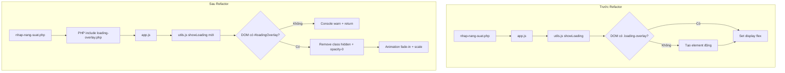

# Kế Hoạch Refactor: Hợp nhất Loading Component

## 1. Tổng Quan

### Mục tiêu

Hợp nhất logic Loading Overlay giữa User App và Admin App để sử dụng chung một component duy nhất (`loading-overlay.php`), đảm bảo tính nhất quán về UI/UX và dễ bảo trì code.

### Hiện trạng

| Approach          | Sử dụng bởi                               | Cơ chế                        | Giao diện                                    |
| ----------------- | ----------------------------------------- | ----------------------------- | -------------------------------------------- |
| **Admin Overlay** | `admin.php`, `admin.js`, `admin-utils.js` | PHP include + JS toggle class | Tailwind, backdrop-blur, animation, icon SVG |
| **User Overlay**  | `app.js`, `utils.js`, `history.js`        | JS tạo động element           | CSS thuần (.loading-overlay, .spinner)       |

### Phạm vi ảnh hưởng

**Files cần sửa đổi:**

- `nhap-nang-suat.php` - Thêm include loading-overlay.php
- `assets/js/modules/utils.js` - Sửa logic showLoading/hideLoading
- `assets/css/style.css` - Có thể xóa hoặc giữ lại class cũ (fallback)

**Files không cần sửa (chỉ tham chiếu):**

- `includes/components/loading-overlay.php` - Giữ nguyên
- `assets/js/modules/admin-utils.js` - Giữ nguyên (làm chuẩn)

---

## 2. Phân Tích Chi Tiết

### 2.1 Component Chuẩn: loading-overlay.php

```php
<!-- includes/components/loading-overlay.php -->
<div id="loadingOverlay" class="fixed inset-0 z-[100] bg-gray-900/50 backdrop-blur-sm hidden flex items-center justify-center transition-all duration-300 opacity-0" style="pointer-events: none;">
    <div class="bg-white p-8 rounded-2xl shadow-2xl flex flex-col items-center gap-5 transform scale-95 transition-all duration-300">
        <div class="relative w-16 h-16">
            <div class="absolute inset-0 border-[6px] border-gray-100 rounded-full"></div>
            <div class="absolute inset-0 border-[6px] border-primary border-t-transparent rounded-full animate-spin"></div>
            <div class="absolute inset-0 flex items-center justify-center">
                <svg class="w-6 h-6 text-primary opacity-50" fill="none" stroke="currentColor" viewBox="0 0 24 24">
                    <path stroke-linecap="round" stroke-linejoin="round" stroke-width="2" d="M13 10V3L4 14h7v7l9-11h-7z"></path>
                </svg>
            </div>
        </div>
        <div class="flex flex-col items-center gap-1">
            <span class="text-gray-800 font-bold text-lg tracking-wide">Đang xử lý</span>
            <span class="text-gray-500 text-sm">Vui lòng đợi trong giây lát...</span>
        </div>
    </div>
</div>
```

**Đặc điểm:**

- Sử dụng `id="loadingOverlay"` để query
- Toggle qua class `hidden` và `opacity-0`
- Animation: `transition-all duration-300`, `scale-95`
- Chặn tương tác: `pointer-events: none` khi ẩn

### 2.2 Logic điều khiển chuẩn (admin-utils.js)

```javascript
export function showLoading(message = null) {
  const overlay = document.getElementById("loadingOverlay");
  if (!overlay) return;

  overlay.classList.remove("hidden");
  void overlay.offsetWidth; // Force reflow

  overlay.style.pointerEvents = "auto";
  overlay.classList.remove("opacity-0");
  overlay.querySelector(".transform").classList.remove("scale-95");

  // Disable modal inputs
  const activeModal = document.querySelector(".modal:not(.hidden)");
  if (activeModal) {
    const buttons = activeModal.querySelectorAll(
      "button, input, select, textarea"
    );
    buttons.forEach((btn) => {
      if (!btn.disabled) {
        btn.dataset.tempDisabled = "true";
        btn.disabled = true;
        if (btn.classList.contains("btn-primary")) {
          btn.classList.add("opacity-70", "cursor-wait");
        }
      }
    });
  }
}

export function hideLoading() {
  const overlay = document.getElementById("loadingOverlay");
  if (!overlay) return;

  overlay.classList.add("opacity-0");
  overlay.querySelector(".transform").classList.add("scale-95");
  overlay.style.pointerEvents = "none";

  setTimeout(() => {
    overlay.classList.add("hidden");
  }, 300);

  // Re-enable modal inputs
  const disabledElements = document.querySelectorAll(
    '[data-temp-disabled="true"]'
  );
  disabledElements.forEach((el) => {
    el.disabled = false;
    delete el.dataset.tempDisabled;
    el.classList.remove("opacity-70", "cursor-wait");
  });
}
```

### 2.3 Logic cũ cần thay thế (utils.js)

```javascript
// Cần thay thế hoàn toàn
export function showLoading() {
  let overlay = document.querySelector(".loading-overlay");
  if (!overlay) {
    overlay = document.createElement("div");
    overlay.className = "loading-overlay";
    overlay.innerHTML = '<div class="spinner"></div>';
    document.body.appendChild(overlay);
  }
  overlay.style.display = "flex";
}

export function hideLoading() {
  const overlay = document.querySelector(".loading-overlay");
  if (overlay) {
    overlay.style.display = "none";
  }
}
```

---

## 3. Kế Hoạch Thực Hiện

### Phase 1: Thêm Component vào User Pages

**Bước 1.1:** Sửa `nhap-nang-suat.php`

```php
<!-- Thêm trước closing </body> tag, sau confirm-modal.php -->
<?php include __DIR__ . '/includes/components/loading-overlay.php'; ?>
```

**Vị trí chính xác:** Dòng 221 (sau `<?php include __DIR__ . '/includes/components/confirm-modal.php'; ?>`)

### Phase 2: Cập nhật JavaScript Logic

**Bước 2.1:** Sửa `assets/js/modules/utils.js`

Thay thế toàn bộ hàm `showLoading` và `hideLoading`:

```javascript
export function showLoading(message = null) {
  const overlay = document.getElementById("loadingOverlay");
  if (!overlay) {
    // Fallback cho trường hợp component chưa được include
    console.warn("loadingOverlay not found in DOM");
    return;
  }

  overlay.classList.remove("hidden");
  void overlay.offsetWidth; // Force reflow for animation

  overlay.style.pointerEvents = "auto";
  overlay.classList.remove("opacity-0");

  const transformEl = overlay.querySelector(".transform");
  if (transformEl) {
    transformEl.classList.remove("scale-95");
  }
}

export function hideLoading() {
  const overlay = document.getElementById("loadingOverlay");
  if (!overlay) return;

  overlay.classList.add("opacity-0");

  const transformEl = overlay.querySelector(".transform");
  if (transformEl) {
    transformEl.classList.add("scale-95");
  }

  overlay.style.pointerEvents = "none";

  setTimeout(() => {
    overlay.classList.add("hidden");
  }, 300);
}
```

**Lưu ý:** Không include logic disable modal buttons như admin-utils vì User App ít modal phức tạp hơn.

### Phase 3: Cleanup (Tùy chọn)

**Bước 3.1:** Giữ nguyên CSS cũ trong `style.css`

CSS class `.loading-overlay` và `.spinner` có thể giữ lại để backwards compatibility hoặc fallback. Không cần xóa ngay.

```css
/* Có thể thêm comment đánh dấu deprecated */
/* [DEPRECATED] Legacy loading styles - kept for backwards compatibility */
.loading-overlay {
  ...;
}
.spinner {
  ...;
}
```

### Phase 4: Testing Checklist

- [ ] Mở trang `nhap-nang-suat.php` - kiểm tra có loadingOverlay trong DOM
- [ ] Gọi `showLoading()` từ console - xác nhận overlay hiện
- [ ] Gọi `hideLoading()` từ console - xác nhận overlay ẩn với animation
- [ ] Tạo báo cáo mới - kiểm tra loading hiển thị đúng
- [ ] Load danh sách báo cáo - kiểm tra loading hiển thị đúng
- [ ] Chuyển tab Lịch sử - kiểm tra loading hiển thị đúng
- [ ] Xem chi tiết báo cáo trong History - kiểm tra loading hiển thị đúng

---

## 4. Diagram Luồng Hoạt Động



---

## 5. Rủi Ro và Giảm Thiểu

| Rủi ro                                    | Mức độ | Giảm thiểu                                       |
| ----------------------------------------- | ------ | ------------------------------------------------ |
| Quên include component ở một số page      | Thấp   | Logic fallback + console.warn                    |
| CSS cũ xung đột với Tailwind mới          | Thấp   | Component dùng ID selector, không xung đột class |
| Animation không hoạt động trên browser cũ | Thấp   | Fallback hidden class vẫn hoạt động              |

---

## 6. Checklist Hoàn Thành

- [ ] Sửa `nhap-nang-suat.php` - thêm include
- [ ] Sửa `assets/js/modules/utils.js` - thay logic mới
- [ ] Test trên trang nhập năng suất
- [ ] Test History module
- [ ] Verify không có console errors
- [ ] Đánh dấu CSS cũ là deprecated (optional)

---

## 7. Ước Lượng Công Việc

| Task             | Files  | Độ phức tạp |
| ---------------- | ------ | ----------- |
| Thêm PHP include | 1 file | Đơn giản    |
| Sửa utils.js     | 1 file | Trung bình  |
| Testing          | -      | Trung bình  |

**Tổng cộng:** 3 files cần chỉnh sửa trực tiếp.
